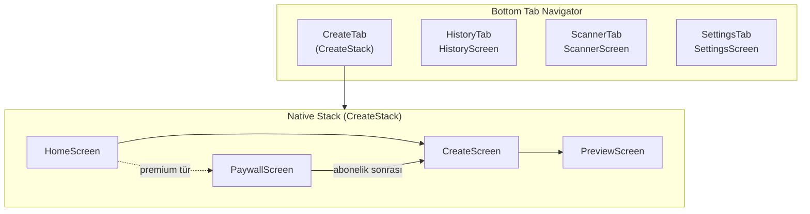

# QRBuilder — Uygulama Şeması

Bu belge projenin mimarisini, ekranları, veri akışını ve bağımlılıkları özetler.

---

## 1. Genel bakış

| Öğe | Değer |
| ----- | -------- |
| Çerçeve | Expo SDK ~55, React Native 0.83 |
| Dil | JavaScript (`.js`) |
| Navigasyon | React Navigation 7 (Tab + Native Stack) |
| Durum | Context API (`Theme`, `Subscription`) |
| Yerel depolama | AsyncStorage |

---

## 2. Giriş noktası ve sağlayıcılar

```text
index.js
  └── App.js
        └── SafeAreaProvider
              └── ThemeProvider          (@qrbuilder_theme)
                    └── SubscriptionProvider
                          └── Root
                                ├── AppNavigator
                                └── StatusBar
```

---

## 3. Navigasyon şeması



| Tab | Stack içi ekranlar | Not |
| ----- | ------------------- | ----- |
| **Oluştur** | Home → Create → Preview (+ Paywall) | Paywall, premium QR türü veya Ayarlar’dan |
| **Geçmiş** | — | Tek ekran |
| **Tara** | — | Kamera + sonuç |
| **Ayarlar** | — | Tema, varsayılan QR, Premium linki |

**İç içe navigasyon:** `SettingsScreen` → `navigation.navigate('CreateTab', { screen: 'Paywall' })`

---

## 4. Ekranlar (`src/screens/`)

| Ekran | Rol | Önemli bağımlılıklar |
| ----- | ----- | ---------------------- |
| **HomeScreen** | QR türü grid’i; premium kontrolü | `QR_TYPES`, `useSubscription` |
| **CreateScreen** | Form alanları; `validateQRForm` → `formatQRData` → Preview | `validators`, `qrFormatter` |
| **PreviewScreen** | QR önizleme, renk/boyut/logo, galeri/paylaş/geçmiş | `QRCodeDisplay`, `preferences`, `storage`, `iap` (dolaylı) |
| **HistoryScreen** | Geçmiş listesi, arama, filtre, modal önizleme | `storage`, `QR_TYPES` |
| **ScannerScreen** | Kamera ile QR okuma, sonuç aksiyonları | `expo-camera`, `Linking`, `Share` |
| **SettingsScreen** | Tema, varsayılan renk/boyut, Premium satırı, hakkında | `preferences`, `useSubscription` |
| **PaywallScreen** | Abonelik özeti, satın alma, geri yükleme | `react-native-iap` (context üzerinden) |

---

## 5. Bileşenler (`src/components/`)

| Bileşen | Kullanım |
| --------- | ---------- |
| **QRTypeCard** | Ana grid kartı; `premium` için kilit rozeti |
| **QRIcon** | MaterialIcons / FontAwesome5 / metin ikon |
| **QRCodeDisplay** | SVG QR + opsiyonel logo |
| **InputField** | Etiketli metin girişi; `hasError` |
| **ColorSwatchRow** | Ön tanımlı renk + özel renk |
| **Toast** | Kısa bildirim (fade animasyon) |

---

## 6. Context’ler (`src/context/`)

### ThemeContext

- **State:** `isDark`, `theme` (light/dark token seti)
- **Persistans:** `@qrbuilder_theme` → `'dark' | 'light'`
- **Kaynak:** `src/constants/themes.js`

### SubscriptionContext

- **State:** `isPremium`, `loading`, `products`, `purchaseLoading`
- **İşlemler:** `purchase`, `restore`, `refresh`
- **Platform:** Android’de `react-native-iap`; dinleyiciler: `purchaseUpdatedListener`, `purchaseErrorListener`
- **Alt katman:** `src/utils/iap.js`, `src/constants/subscription.js`

---

## 7. Sabitler (`src/constants/`)

### `qrTypes.js`

Her öğe: `id`, `label`, `icon`, `description`, `fields[]`, `premium` (`boolean`).

| id                                                                         | premium |
| -------------------------------------------------------------------------- | ------- |
| url, text                                                                  | `false` |
| email, phone, sms, wifi, vcard, whatsapp, instagram, twitter, youtube, gps | `true`  |

### `themes.js`

`darkTheme` / `lightTheme`: renk token’ları (background, card, accent, text, …).

### `subscription.js`

- `SUBSCRIPTION_SKUS` (Play ürün ID’leri)
- `PREMIUM_FEATURES` (Paywall metni)

---

## 8. Yardımcılar (`src/utils/`)

| Modül | Görev |
| ------- | -------- |
| **qrFormatter.js** | `formatQRData(typeId, formData)` → QR string (mailto, tel, WIFI:, VCARD, wa.me, …) |
| **validators.js** | `validateQRForm(typeId, data)` → `{ field, message }` veya `null` |
| **storage.js** | Geçmiş: `saveQRToHistory`, `getHistory`, `deleteQRFromHistory`, `clearHistory` |
| **preferences.js** | `@qrbuilder_prefs`: varsayılan fg/bg renk, QR boyutu |
| **iap.js** | `initIAP`, `fetchProducts` (subs), `purchaseSubscription`, `restorePurchases`, `checkIsSubscribed` |

---

## 9. Yerel depolama anahtarları

| Anahtar | İçerik |
| --------- | -------- |
| `@qrbuilder_history` | QR geçmişi dizisi (id, typeId, typeLabel, qrValue, formData, fgColor, bgColor, createdAt) |
| `@qrbuilder_theme` | `'dark'` / `'light'` |
| `@qrbuilder_prefs` | `{ defaultFgColor, defaultBgColor, defaultQrSize }` |

---

## 10. Harici / native entegrasyonlar

| Paket | Kullanım yeri |
| ------- | ---------------- |
| expo-camera | ScannerScreen |
| expo-image-picker | PreviewScreen (logo) |
| expo-media-library | Galeriye kaydet |
| expo-sharing | Paylaş |
| expo-file-system | Geçici PNG yazma/silme |
| expo-haptics | Dokunsal geri bildirim |
| react-native-qrcode-svg | QR çizimi |
| react-native-iap | Abonelik (Android; EAS/dev build) |

---

## 11. Ana kullanıcı akışları

### QR oluşturma (ücretsiz tür)

`Home` → `Create` (form) → `Preview` → (isteğe bağlı) geçmişe kaydet / galeri / paylaş

### QR oluşturma (premium tür, abonelik yok)

`Home` → `Paywall` → satın alma veya geri → `Create`

### QR tarama

`ScannerTab` → kamera → sonuç → aç / paylaş / tekrar tara

### Geçmiş

`HistoryTab` → liste / arama / tür chip’i → sil / büyük önizleme modalı

---

## 12. Yapılandırma dosyaları

| Dosya | İçerik özeti |
| ------- | ---------------- |
| **app.json** | `slug`, ikonlar, splash, `bundleIdentifier` / `package` (`com.qrbuilder.app`), izinler, Expo plugin’leri, EAS `projectId` |
| **eas.json** | `development` (dev client, APK), `preview` (internal APK), `production` (AAB) |
| **package.json** | Bağımlılıklar ve script’ler |

---

## 13. Dosya ağacı (kaynak)

```text
QRBuilder/
├── App.js
├── index.js
├── app.json
├── eas.json
├── package.json
├── assets/
└── src/
    ├── navigation/
    │   └── AppNavigator.js
    ├── screens/
    │   ├── HomeScreen.js
    │   ├── CreateScreen.js
    │   ├── PreviewScreen.js
    │   ├── HistoryScreen.js
    │   ├── ScannerScreen.js
    │   ├── SettingsScreen.js
    │   └── PaywallScreen.js
    ├── components/
    │   ├── QRTypeCard.js
    │   ├── QRIcon.js
    │   ├── QRCodeDisplay.js
    │   ├── InputField.js
    │   ├── ColorSwatchRow.js
    │   └── Toast.js
    ├── context/
    │   ├── ThemeContext.js
    │   └── SubscriptionContext.js
    ├── constants/
    │   ├── qrTypes.js
    │   ├── themes.js
    │   └── subscription.js
    └── utils/
        ├── qrFormatter.js
        ├── validators.js
        ├── storage.js
        ├── preferences.js
        └── iap.js
```

---

## 14. Notlar

- **Expo Go:** `react-native-iap` dahil native IAP için production benzeri build gerekir (EAS / `expo run:android`).
- **Abonelik fiyatı:** Play Console’da tanımlanır; uygulama `localizedPrice` ile gösterir.
- Bu şema, depodaki mevcut dosya yapısına göre üretilmiştir; yeni ekran/modül eklendikçe güncellenmelidir.
